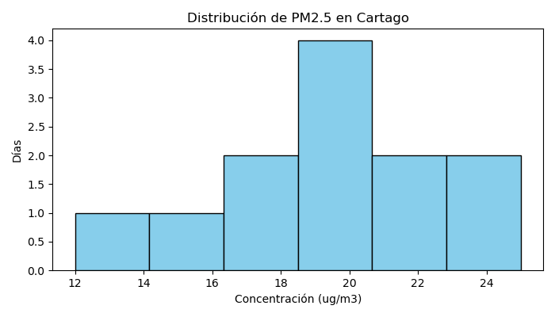
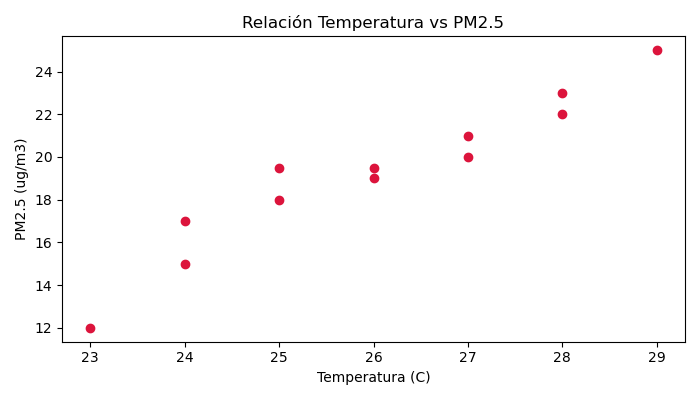

# Plantilla de Preguntas de Análisis y Respuestas - Parcial 1 IA

**Asignatura:** Inteligencia Artificial  
**Profesor:** Jhon James Cano Sánchez  
**Repositorio GitHub:** `https://github.com/moliech/parcial1-ia-grupo05`  
**Grupo:** Grupo 05 (Cartago, Valle del Cauca)  
**Integrantes:** Jhon Esteban Molina y Heiber Lozano Mercado 
**Dataset:** `grupo_05.csv` 

---

## 1. Configuración del Entorno

### Instrucciones para reproducir el entorno Docker:
1. Clonar el repositorio público de GitHub:
   ```bash
   git clone https://github.com/moliech/parcial1-ia-grupo05.git
   cd parcial1-ia-grupo05
   ```
2. Ejecutar la construcción y puesta en marcha con Docker Compose:
   ```bash
   docker compose up --build
   ```

---

## 2. Carga de Datos (`analisis.py`)

* **Vista previa de las primeras 5 filas:**
  ```text
  2026-01-01,15,30,24,70
  2026-01-02,18,35,25,72
  2026-01-03,12,28,23,68
  2026-01-04,15000,45,26,74
  2026-01-05,20,38,27,75
  ```
* **Número total de registros cargados:** `12 filas de datos`

---

## 3. Calidad de Datos

### Problemas de Calidad Identificados (Mínimo 3)

#### Problema 1: Valor Atípico Extremo (Outlier)
* **¿Cómo se detectó?**  
  Al revisar los datos de PM2.5, se encontró que el 4 de enero de 2026 tenía un valor de 15.000 µg/m³, mientras que los demás registros estaban entre 12 y 25 µg/m³. Por esta diferencia tan grande, se consideró que el dato correspondía a un error de registro.
* **¿Qué decisión se tomó para manejarlo?**  
  Se descartó el valor de 15.000 µg/m³ y se reemplazó por 19,5 µg/m³, que representa el valor central de los registros válidos.
* **¿Por qué tomó esa decisión?**  
  Porque conservar un dato claramente erróneo alteraría demasiado los resultados y podría hacer parecer que hubo un nivel de contaminación extremo en Cartago, cuando los demás registros no muestran ese comportamiento.

#### Problema 2: Dato Faltante (Missing Value)
* **¿Cómo se detectó?**  
  Al revisar los registros, se encontró que el 11 de enero de 2026 no tenía un valor registrado para PM2.5. El registro aparecía así: 2026-01-11,,37,25,70.
* **¿Qué decisión se tomó para manejarlo?**  
  Se reemplazó el espacio vacío por 19,5 µg/m³, utilizando como referencia el valor central de los registros válidos de PM2.5.
* **¿Por qué tomó esa decisión?**  
  Para completar el registro y evitar que el dato faltante afectara los análisis posteriores, manteniendo un valor representativo del comportamiento general de los datos.

#### Problema 3: Formato e Inconsistencia del Nombre de Archivo
* **¿Cómo se detectó?**  
  El archivo original tenía extensión .txt, aunque su contenido estaba organizado mediante valores separados por comas, es decir, tenía una estructura propia de un archivo CSV.
* **¿Qué decisión se tomó para manejarlo?**  
  Se organizó el archivo en formato CSV y se estableció el nombre grupo_05.csv.
* **¿Por qué tomó esa decisión?**  
  Para trabajar con un formato adecuado para el procesamiento de los datos y facilitar su lectura desde Python y las demás herramientas utilizadas en el proyecto.

### Pregunta Clave de Calidad de Datos:
* **¿Hay algún valor en los datos que le parezca sospechoso o inconsistente? ¿Cómo afecta el análisis si no se corrige?**  
* 
  Sí. El valor de 15.000 µg/m³ registrado el 4 de enero de 2026 resulta altamente sospechoso, ya que es muy diferente al resto de los registros, que se encuentran aproximadamente entre 12 y 25 µg/m³.
  
  Si este valor se mantiene, altera significativamente los resultados estadísticos, aumentando el promedio hasta 1.381,09 µg/m³ y la desviación estándar hasta 4.307,72 µg/m³. Esto podría llevar a interpretar los datos como si existiera un nivel de contaminación extremadamente alto, cuando el resto de los registros no presenta ese comportamiento.

---

## 4. Análisis Estadístico (NumPy)

### Tabla de Métricas Estadísticas (`pm25`)

| Métrica | Datos Originales (Con Outlier) | Datos Limpios (Con NumPy) |
| :--- | :---: | :---: |
| **Media** | $1381.09\ \mu g/m^3$ | **$19.20\ \mu g/m^3$** |
| **Mediana** | $20.00\ \mu g/m^3$ | **$19.50\ \mu g/m^3$** |
| **Desviación Estándar** | $4307.72\ \mu g/m^3$ | **$3.68\ \mu g/m^3$** |
| **Mínimo** | $12.00\ \mu g/m^3$ | **$12.00\ \mu g/m^3$** |
| **Máximo** | $15000.00\ \mu g/m^3$ | **$25.00\ \mu g/m^3$** |

### Pregunta Clave Estadística:
* **¿El promedio es representativo de los datos? ¿Por qué sí o por qué no? Justifique con números.**  
 
  * Sí, el promedio es representativo de los datos después de corregir el valor atípico de 15.000 µg/m³. El promedio obtenido es de 19,20 µg/m³, muy cercano a la mediana de 19,50 µg/m³. Además, la desviación estándar es de 3,68 µg/m³, lo que indica que los valores no presentan una variación muy grande respecto al promedio.
  * 
  * Por lo tanto, los resultados muestran que 19,20 µg/m³ es un valor que representa adecuadamente el comportamiento general de las mediciones, una vez corregido el dato atípico.

---

## 5. Visualización (Matplotlib)

### Gráfico 1: Distribución de la Variable Principal (`pm25`)



* **¿Qué muestra?**  
  Un histograma que muestra cuántos días se registraron diferentes niveles de concentración de PM2.5 en Cartago.
* **¿Qué conclusión extrae?**  
  La mayor parte de los días monitoreados presenta valores de PM2.5 entre 15 y 25 µg/m³. Esto indica que, después de corregir el dato atípico, las mediciones se concentran principalmente en ese rango y no presentan valores extremos frecuentes.

---

### Gráfico 2: Relación entre Variables (`pm25` vs `temperatura_c`)



* **¿Qué muestra?**  
  Un gráfico de dispersión que relaciona la temperatura ambiental, medida en grados Celsius, con la concentración de PM2.5 registrada en cada día.
* **¿Qué conclusión extrae?**  
  Se observa una ligera tendencia positiva: en los registros con temperaturas superiores a 27 °C, los valores de PM2.5 tienden a ubicarse en niveles más altos, cercanos a 25 µg/m³. Sin embargo, esta relación es leve, por lo que los datos no permiten afirmar que el aumento de temperatura sea la causa del aumento de PM2.5.

---

## 6. Interpretación Profunda

* **¿Qué relación existe entre las variables del dataset? ¿Hay correlación? ¿Es causalidad?**  
  Existe una correlación positiva moderada entre la temperatura y la concentración de PM2.5. Esto significa que, en estos datos, cuando aumenta la temperatura, los valores de PM2.5 tienden también a aumentar. Sin embargo, correlación no significa causalidad. Con este análisis no podemos afirmar que el aumento de temperatura sea directamente responsable del aumento de PM2.5.
* **¿Qué historia cuentan los datos sobre la problemática de Cartago?**  
  Los datos analizados muestran que, después de corregir el valor atípico, la concentración promedio de PM2.5 fue de 19,20 µg/m³, y la mayoría de los registros se mantuvo en un rango relativamente cercano. Esto sugiere que en el período y los datos analizados no se observa un comportamiento extremo o sostenido de contaminación.  
  
  Además, el análisis evidencia la importancia de verificar la calidad de los datos antes de sacar conclusiones, ya que un solo registro anormal podía cambiar significativamente los resultados.
* **¿Qué patrones o tendencias no son evidentes a simple vista?**  
  A simple vista, el valor de 15.000 µg/m³ registrado el 4 de enero de 2026 podría interpretarse como un evento extremo de contaminación. Sin embargo, al comparar este registro con el resto de los datos, se encontró que era muy diferente al comportamiento general. Por esta razón, se identificó como un posible error de medición o registro y se corrigió antes de realizar el análisis estadístico.

---

## 7. Recomendación

* **Recomendación para la comunidad o gobierno local:**  
  1. Implementar controles de calidad en la red de sensores, incluyendo mantenimiento periódico, revisión de lecturas anormales y alertas que permitan detectar rápidamente valores fuera del comportamiento esperado.
  2. Informar los resultados de manera clara y contextualizada, indicando que, después de corregir el dato atípico, los registros analizados muestran niveles de PM2.5 relativamente estables. Sin embargo, estos resultados corresponden únicamente al período y conjunto de datos analizados y no permiten por sí solos evaluar la calidad del aire de todo el municipio.
* **Justificación con al menos 3 números específicos del dataset:**  
  * El promedio después de corregir el dato atípico fue de 19,20 µg/m³
  * El valor máximo entre los registros considerados válidos fue de 25,00 µg/m³.
  * El registro anómalo de 15.000 µg/m³ fue aproximadamente 781 veces mayor que el promedio de 19,20 µg/m³.veces** el valor promedio real del municipio.

---

## 8. Limitaciones

* **¿Qué limitaciones tienen estos datos para tomar decisiones?**  
  El periodo de monitoreo es muy reducido (únicamente 12 días), lo que impide evaluar la estacionalidad anual o el impacto en épocas de lluvias vs sequías.
* **¿Qué datos adicionales necesitaría para hacer un análisis más completo?**  
  Se requerirían variables meteorológicas de velocidad y dirección del viento, precipitación pluvial diaria y volumen de tráfico vehicular en Cartago.
